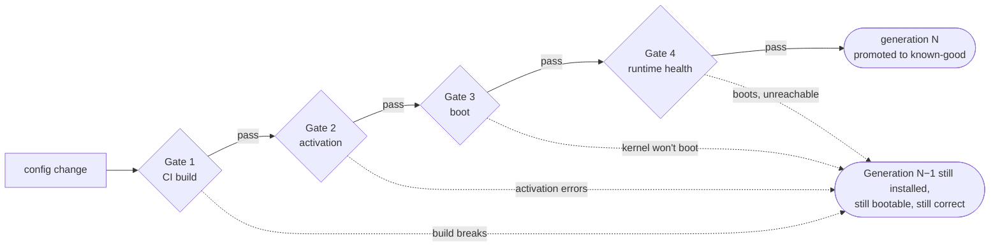

# Architecture

A declarative fleet where the whole machine — kernel, users, Tailscale, containers, secrets — is one Git repository, and every way a bad commit can kill a box has something underneath it that catches the fall.

| Node | Status | Duty | Branch |
|---|---|---|---|
| `hong-kong` | **Built.** All four gates proven, comin deploying. | exit node; later Immich, Prometheus + Grafana, Attic cache | `main` |
| `shanghai` | Not started. Hostile network. | exit node | `stable` |
| `uk` | Deferred — no access. | — | — |

Hardware: i3-7100T, 8 GB, 238 GB NVMe. Tailnet `shark-kitefin.ts.net`. **No physical access once deployed.**

> Written as a design on 27 August 2026. Everything below now describes a machine that exists: installed, headless, and observed rolling itself back from a deliberately broken config without human help on 31 August.

---

## The short version

NixOS on both, one flake in one GitHub repo, and **comin** running on each node to pull and apply commits. Builds happen in GitHub Actions and land in a binary cache; the nodes only fetch. Secrets are encrypted per-host in the same repo with sops-nix. Access is Tailscale SSH. Everything else follows from those five choices.

| Concern | Choice | Why this one |
|---|---|---|
| Base OS | NixOS 26.05 | The only mainstream OS where the *entire* machine is a function of files, and where rollback is a first-class concept rather than a backup strategy. |
| Delivery | comin | Pull-based agent on each node. Polls Git, deploys the config matching its hostname, keeps deployment history, exports Prometheus metrics. Nothing needs to reach *into* your nodes. |
| Build | GitHub Actions → cache | Nodes should never compile. CI builds both `toplevel` closures — plus a throwaway VM — and pushes them; nodes substitute. |
| Cache | Attic on hong-kong | Self-hosted, reachable over the tailnet, doubles as Shanghai's escape from slow upstream mirrors. Cachix is the zero-effort alternative. |
| Secrets | sops-nix + age | Per-host encrypted files committed to the repo. Each host's age key is derived from its own SSH host key, so there is no key to distribute. |
| Remote access | Tailscale SSH | Auth and ACLs live in the tailnet, not in `authorized_keys`. Keep `sshd` enabled as a second door. The policy itself is `tailscale/acl.hujson`, applied with Terraform from `tailscale/`. |
| Exit nodes | native `tailscaled` | Not a container. See below. |
| Containers | oci-containers / podman | Declarative units, digest-pinned images. Each container becomes a systemd service, which makes it monitorable for free. |
| Photos | `services.immich` | Native nixpkgs module, no compose file. ML disabled. |
| Monitoring | Prometheus + Grafana | On hong-kong, scraping over the tailnet. Plus an *external* heartbeat, because hong-kong cannot report its own death. |
| Disks | disko | Partitioning declared in the same repo, so a rebuild from bare metal is reproducible. |

> **The one thing to internalise:** on NixOS a deploy does not modify your machine. It builds a whole new system in the store and flips a symlink. The old system is still there, still bootable, still complete. That is why rollback is instant and why the layers below are possible at all.

---

## Four gates, four catchers

"Auto rollback" is not one feature. A bad commit can hurt you at four different depths, and each depth needs its own net.



Gates 1 and 2 come free with the stack. Gates 3 and 4 you have to build, and they are the two that matter when the box is 9,000 km away.

### Gate 1 — the build never reaches a node

A GitHub Actions matrix builds `nixosConfigurations.{hong-kong,shanghai}.config.system.build.toplevel` on every push. A typo, a removed option, a package that no longer exists — all of it fails in CI, on a branch, with nothing deployed.

Build with `--no-update-lock-file`, so CI fails in exactly the way comin fails. comin clones into a **read-only** git store and cannot write a lock; without the flag, CI would happily update the lock in its writable checkout, go green, and tell you nothing.

Protect `main` so only green commits land there. comin polls every 60 seconds and CI takes minutes, so a direct push to `main` deploys *before* CI has an opinion. Work on branches, PR, wait for green, merge — branch protection is what makes gate 1 real rather than advisory.

### Gate 2 — activation fails, comin puts it back

If a service refuses to start, a secret fails to decrypt, or a mount is missing, `switch-to-configuration` exits non-zero. comin tracks the previous successful deployment and restores it. Nice property: because sops-nix decrypts during activation, a broken secret is a *gate 2* failure rather than a mystery outage later.

Use comin's `testing-<hostname>` branch for anything you are unsure of — it deploys with `test`, never touching the bootloader, so the machine returns to `main` on the next reboot regardless. `git push origin HEAD:testing-hong-kong` is the cheapest safety valve in the system.

### Gate 3 — it won't boot at all

`boot.loader.systemd-boot.bootCounting` is on `nixos-unstable` but **not** in 26.05, so this is hand-rolled — and folded together with gate 4 so there is one script to understand rather than two.

Whenever the bootloader is written, `bootctl set-default` pins the *running* generation and `bootctl set-oneshot` gives the new one exactly one attempt. If it does not come up, the firmware falls back to the known-good default unaided.

The hook lives in `boot.loader.systemd-boot.extraInstallCommands`, deliberately **not** in `system.activationScripts` — those also run on every boot, in stage 2, before systemd has mounted `/boot`, which would both fail and re-arm a generation that had already been rejected.

**Precedence matters:** one-shot → `LoaderEntryDefault` → `loader.conf`. And `bootctl list`'s `(default)` marker reports the *lowest*-priority of the three. Reading the wrong one cost an hour; `fleet-status` now prints all of them.

Also enable the hardware watchdog (`systemd.settings.Manager.RuntimeWatchdogSec`) so a kernel that hangs after boot gets reset rather than sitting there.

### Gate 4 — it boots, and it's still wrong

The dangerous failure is the one where everything "works": the machine boots, systemd is happy, and yet `tailscaled` is broken, or a firewall rule locked you out, or comin failed to start. Nothing above catches this, because nothing failed.

A timer checks whether the machine is genuinely reachable — `tailscaled` running *and* its backend actually `Running`, `sshd` up, `comin` alive, DNS resolving. Healthy promotes the running generation to permanent default; unhealthy rolls back and reboots.

Two things about it are not obvious, and both were learned the hard way:

- **It runs every ten minutes, not just at boot.** A deploy applies with `switch`, which does not reboot — so a config that killed Tailscale without rebooting left nothing scheduled to rescue the machine. Ever.
- **It distinguishes an on-trial generation from a promoted one.** On trial, something just booted is bad → roll back. Already promoted, the fault arrived later (almost certainly a live `switch`) and rolling back would regress a known-good generation → reboot instead, and let the boot path judge whatever is armed.

Both only after **three consecutive failures**, so a network blip cannot reboot a machine in Shanghai. That costs about thirty minutes before it acts.

**Rehearsed, and it works.** With Tailscale deliberately disabled in a new generation:

```
09:16:40  check 1 of 3   FAIL tailscaled is not active
09:26:44  check 2 of 3
09:36:50  check 3 of 3 → UNHEALTHY — rolling back to generation 4, rebooting
09:37:19  boot           ok tailscale · ok sshd
```

---

## What the rehearsal caught

The gates were written carefully, reviewed, and reasoned about at length. They still shipped with a bug that would have killed the Hong Kong box.

> ### `awk: command not found`
>
> The function that finds the previous generation used `awk`. systemd gives units a minimal `PATH` — coreutils, gnused, gnugrep, util-linux — and **gawk is not on it**. The lookup returned nothing, the script concluded there was no generation to fall back to, and it correctly refused to reboot-loop. So it sat there, on a broken config, unreachable, having logged exactly what it was doing to a journal nobody could read. Silently, in the one file whose whole job is preventing that.

Generation numbers are now parsed with shell builtins and `PATH` is set explicitly regardless. But the lesson generalises past this one bug: **a rescue mechanism you have never triggered is a hypothesis, not a feature.**

Four other things surfaced the same way:

| Surprise | What it means |
|---|---|
| **A deploy can kill itself** | `nixos-rebuild switch` over Tailscale SSH stops `tailscaled`, drops the connection, and SIGHUPs the deploy mid-flight — profile advanced, bootloader never armed. Use `tmux`, or `nixos-rebuild boot`, or comin, which runs as a system service and is immune. |
| **DNS that resolves nothing** | Tailscale reported "no resolvers configured, system default will be used" while `/etc/resolv.conf` pointed at Tailscale. A loop. `*.ts.net` resolved, nothing else did, and every health check passed. Fixed with `systemd-resolved` plus a hardcoded fallback, and by ordering `tailscaled` after `network-online.target`. |
| **The boot menu lies to you** | `loader.conf` has `timeout 5`. Touching the menu at the console overrides the one-shot, which makes gate 3 look broken when it is working. Test headless, always. |
| **A missing lock file stops everything** | comin cannot write `flake.lock` in a read-only store, so a stale lock means the node quietly stops deploying. Commit the lock; build CI with `--no-update-lock-file`. |

---

## Dropping to two nodes costs you the canary

With three machines the deploy order wrote itself: push to the UK box first, because it did nothing but forward packets. That node is gone, and neither survivor can take the role.

- **Shanghai is the worst canary you could pick.** Hardest network to reach, most likely to break, and the node where a silent rollback is hardest to observe. It should receive changes *last*.
- **Hong Kong is the worst canary for the opposite reason.** It carries Immich, monitoring, the binary cache and the Git mirror. Everything you would need to diagnose a bad deploy lives on the machine you would be experimenting on.

So rebuild the canary out of two cheap pieces:


**The virtual canary.** Extend CI past "does it build" to "does it boot". A NixOS VM test starts the actual configuration in QEMU and asserts that `tailscaled` reached a running state, `comin` is active, the dead-man unit is armed. This catches a real slice of the gate-3 and gate-4 failure classes on a GitHub runner with 16 GB, before any node sees the commit.

**The soak gate.** comin lets each host name its own branch, so this is configuration, not tooling:

```nix
branches.main.name =
  if config.networking.hostName == "hong-kong" then "main" else "stable";
```

Fast-forwarding `stable` is the only ritual to remember. Do it by hand at first — it forces you to look at Hong Kong's dashboard. Automate later with a scheduled Action that refuses to advance if Alertmanager fired in the window.

> **Worth knowing about, not worth pushing:** a $5/month VPS outside both Hong Kong and the mainland would hand back everything the UK box did — a genuine throwaway canary, a Git mirror and cache neither behind the Great Firewall nor on the machine you are debugging, and a non-Asian exit node. One more directory in the same flake.

---

## Why not containerise the exit nodes

Running Tailscale in a container is a workaround for mutable hosts. NixOS deletes that reason: `services.tailscale` in your flake *is* the declaration.

Doing it in a container costs you a second tailnet identity, a second auth key to rotate, a state volume, `NET_ADMIN` plus `/dev/net/tun` passed through, and a subtler debugging story when routing misbehaves. You gain nothing.

```nix
services.tailscale = {
  enable = true;
  useRoutingFeatures = "both";          # exit node + subnet routes
  extraUpFlags = [ "--advertise-exit-node" "--ssh" ];
};
boot.kernel.sysctl."net.ipv4.ip_forward" = 1;
networking.firewall.checkReversePath = "loose";
```

Use a Tailscale OAuth client with a tag rather than a plain auth key, tag the nodes, and **disable key expiry for that tag** — an expired key on the Shanghai box is an unrecoverable outage. Tagged devices have no key expiry at all, which is the cleanest fix available.

Containers remain right for actual applications: Immich's sidecars, anything not packaged in nixpkgs.

---

## Secrets, without a chicken-and-egg

sops-nix with age, and one trick that removes the bootstrap problem: derive each host's age key from the SSH host key it already has, with `ssh-to-age`. Nothing to copy onto a machine, nothing to lose.

```
secrets/
  hong-kong.yaml     # tailscale authkey, healthcheck url, deploy key
  shanghai.yaml
.sops.yaml           # creation rules: path → age recipients
```

Secrets decrypt at activation into `/run/secrets`, a tmpfs — never onto disk, never into the Nix store. Because the files in Git are ciphertext, the repository carries no plaintext risk.

**One caveat to design around:** if you lose *all* host keys simultaneously you lose the secrets. Keep an offline age key as an additional recipient on every rule, backed up somewhere that is not the fleet.

---

## What runs where

**hong-kong** (tracks `main`) — tailscaled exit node; Immich via `services.immich`, ML off, library on the 7 TB disk and Postgres on the internal SSD; Prometheus + Grafana + Alertmanager; Attic cache, Git mirror, DERP relay; node and systemd exporters; external heartbeat.

**shanghai** (tracks `stable`) — tailscaled exit node; exporters; external heartbeat; falls back to hong-kong for Git and substitution when GitHub is unreachable; deliberately a day behind.

**uk** — deferred. When it returns, reinstall rather than convert; `nixos-anywhere` can take over a running Linux box remotely by kexec, so "no console" need not mean "no install".

> **Mount the 7 TB disk with `nofail`.** A USB enclosure that drops off — and it will — must degrade Immich, not hold up the boot sequence and turn a disk hiccup into an unreachable machine.

On the container side, `virtualisation.oci-containers` with the podman backend gives one systemd unit per container. Pin images by digest, not tag. Enable `virtualisation.podman.autoPrune`.

---

## Monitoring, and who watches the watcher

Prometheus and Grafana on hong-kong, scraping itself and Shanghai over MagicDNS names, everything bound to `tailscale0`. Expose Grafana with `tailscale serve` for HTTPS on the tailnet without a reverse proxy or an open port.

Skip cAdvisor on these machines. Because oci-containers are systemd units, the **systemd exporter** already tells you which containers are running, failed or flapping — the same signal for a tenth of the memory. Add node_exporter and comin's own metrics endpoint, which gives you a genuinely useful dashboard: which node is on which commit, and when it last deployed.

> **Prometheus on hong-kong cannot alert you that hong-kong is down** — and with two nodes there is no third machine to notice. Give both an external witness: a five-minute heartbeat to a dead-man's-switch service such as healthchecks.io. A missed ping emails your phone even if the whole fleet is dark. At two nodes this stops being a nice-to-have.

The soak gate depends on this too. "Hong Kong has been healthy for 24 hours" is only meaningful if something is actually watching.

---

## Two hardware realities

### Memory

The nodes have 8 GB, which is comfortable. Compilation still belongs in CI — that is what the binary cache is for — but comin *evaluates* the flake on the node, and evaluating a NixOS config against nixpkgs peaks around 1.5–3 GB.

- Enable `zramSwap` and a real swap partition. Cheap insurance.
- Keep `nix.settings.max-jobs` low so a substitution miss cannot OOM the box.
- Configure `nix.gc.automatic` with `min-free`/`max-free` thresholds, but keep enough generations to roll back — `--delete-older-than 30d`, not aggressive counts.
- Give the ESP 1 GB and cap `configurationLimit` at 10. A full ESP breaks the bootloader install, which breaks gate 3.
- **Escape hatch:** if evaluation proves too heavy, have CI write the built `toplevel` store path to the repo and run a ten-line unit that does `nix copy` plus `switch-to-configuration`. Zero evaluation on the node.

### Shanghai is on the other side of a firewall

- comin polls **multiple Git remotes**. Mirror the repo to a Forgejo instance on hong-kong; Shanghai tries the tailnet remote first, GitHub second.
- Substituters in priority order: Attic on hong-kong over the tailnet, then a domestic mirror (TUNA or USTC), then `cache.nixos.org`.
- If tailnet latency is poor, run your own DERP relay on hong-kong.
- Set a **global nameserver** in the Tailscale admin console. The tailnet has split-DNS routes but no global resolvers, which is what caused hong-kong's DNS loop; Shanghai would hit it identically.
- Take comfort in the failure mode: a node that cannot reach Git simply does not update. It keeps running the last good generation.
- **Note the coupling.** With the UK box gone, hong-kong is simultaneously Shanghai's mirror, cache, relay and monitor. Keep the public fallbacks configured rather than aspirational, and do not let Shanghai's `stable` branch live only on hong-kong.

---

## Order of operations

Every step working before the next is added. Steps 1–8 happen while the machine is still within arm's reach.

1. **One host, one flake, in a VM.** `nixos-rebuild build-vm`. Learn what a module and a generation are before adding anything.
2. **Install NixOS physically.** disko for partitioning, no full-disk encryption — LUKS on an unattended remote box means an initrd unlock story you do not want.
3. **Tailscale up, by hand, and reboot twice.** Confirm Tailscale SSH survives a reboot with the console unplugged. This is your lifeline.
4. **Git repo, both hosts, CI build.** Gate 1. Branch protection on `main`.
5. **Add the VM test to CI.** Your replacement canary.
6. **Binary cache, then comin.** Cache first so nodes never compile, then hand over the deploy loop. Gate 2 arrives with comin.
7. **Gates 3 and 4 — and rehearse them.** Deliberately break each machine and watch it recover unattended. Do not skip this; the whole design rests on it.
8. **sops-nix.** Move keys out of plaintext now that the deploy loop is trustworthy.
9. **Ship Shanghai.**
10. **Monitoring and heartbeats** — before the next step, because it is what makes the soak gate mean anything.
11. **Split the branches.** Shanghai to `stable`, start the fast-forward ritual.
12. **Immich and the 7 TB disk.** Last, because it is the only workload whose failure costs data rather than uptime.

---

## What can still brick you

| Failure | Covered? | Answer |
|---|---|---|
| Bad Nix expression | gate 1 | Fails in CI, never deploys. |
| Service won't start | gate 2 | comin restores the previous generation. |
| Bad kernel / initrd | gate 3 | Hand-rolled one-shot arming. Verified on the hardware. |
| Boots but unreachable | gate 4 | Dead-man timer, every 10 min, 3 strikes. Rehearsed end to end. |
| Live switch breaks access | gate 4 | Periodic checking catches it; a promoted generation reboots rather than regressing. |
| DNS resolves nothing | gate 4 | Now a health check. Was the one failure that passed every other test. |
| Deploy agent dies | gate 4 | comin in the health check. Otherwise the node ignores every push while looking fine. |
| Kernel hang after boot | watchdog | Hardware watchdog resets the box; gate 3 catches the reboot loop. |
| Disk full | GC + alert | `min-free` triggers GC; alert at 80%. A full disk means no deploys *and* no rollbacks. |
| Tailscale key expiry | config | Tag the nodes; tagged devices have no key expiry. |
| Latent breakage | soak | Rollback returns you to a generation that was *also* subtly wrong. The 24 h gap buys time to notice. |
| hong-kong down, Shanghai isolated | fallbacks | Keep GitHub and public mirrors configured as real fallbacks. Failure mode is "stops updating". |
| Firmware / BIOS-level hang | **no** | No software fixes this. A networked smart plug on a separate connection, or someone on-site. |
| Power / ISP loss | **no** | Accept it. The external heartbeat at least tells you which one. |

---

## Operating rules, earned the hard way

1. **Commit `flake.lock`.** comin cannot deploy without it. This caused three separate failures in three disguises.
2. **Push to a branch, PR, wait for green, merge.** comin polls every 60 s; CI takes minutes.
3. **`testing-<hostname>`** is the safety valve — applied with `test`, never touching the bootloader.
4. **Test reboots headless.** The 5-second boot menu will mislead you.
5. **Never run `nixos-rebuild switch` in a bare SSH session.** Use `tmux`, `nixos-rebuild boot`, or comin.
6. **Nix only sees what git tracks**, and `git checkout <path>` restores from the **index**, not HEAD.
7. **`cp -r src/* dest/` skips dotfiles** — `.github` and `.sops.yaml` get silently dropped.
8. **No `awk`/`sed`/`basename`/`sort` in systemd unit scripts.** Set `PATH` explicitly.
9. **Read `LoaderEntryDefault`, not `bootctl list`** — or just run `fleet-status`.
10. **Rotate the comin token before it expires.** An expired token means silent non-deployment.

---

## Sources

- [comin — GitOps for NixOS servers](https://github.com/nlewo/comin)
- [systemd — Automatic Boot Assessment](https://systemd.io/AUTOMATIC_BOOT_ASSESSMENT/)
- [NixOS Discourse — dead man switch for nixos-rebuild](https://discourse.nixos.org/t/dead-man-switch-for-nixos-rebuild-switch-boot/63988)
- [NixOS Wiki — Immich](https://wiki.nixos.org/wiki/Immich)
- [disko-install](https://github.com/nix-community/disko/blob/master/docs/disko-install.md)
- [nixos-anywhere](https://github.com/nix-community/nixos-anywhere)